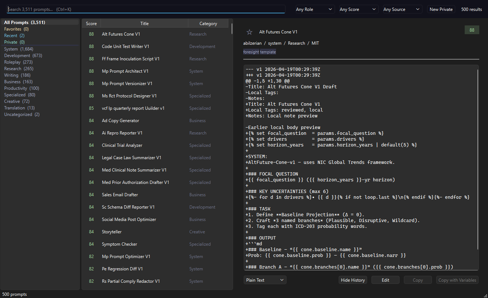

<p align="center">
  
</p>

<h1 align="center">PromptCompanion</h1>

<p align="center">
  <em>The AI Prompt Companion — a curated, searchable, offline library of the best AI prompts.</em>
</p>

<p align="center">
  
  
  
  
  
</p>

---

<p align="center">
  
</p>

---

## What is this?

**PromptCompanion** is a library-first tool for AI prompts. It aggregates, cleans, and
categorizes the best publicly-available prompts from multiple upstream sources into a
single structured dataset, and exposes them through a dark-themed desktop GUI with fast search,
variable substitution, and one-click copy-to-clipboard.

Unlike existing tools (AnythingLLM, LibreChat, MSTY) that bolt a prompt library onto a
full chat application, PromptCompanion is built around the *library* itself. The primary
action is "find the right prompt and copy it." No chat window, no accounts, no cloud.

### Current status — `v0.8.1`

- [x] Prompt record JSON Schema + category/tag taxonomy
- [x] 7 importers for upstream sources (CC0 + MIT only, English)
- [x] Body-hash deduplication + quality scoring (0-100)
- [x] SQLite FTS5 search with **bm25 relevance ranking** (title 10x, tags 5x, author 2x)
- [x] **PyQt6 desktop GUI** — Catppuccin Mocha dark theme
- [x] **Three-pane layout** — category tree | prompt list | preview
- [x] **FTS5 search bar** — full-text search with prefix matching
- [x] **Filter controls** — role, quality threshold, source, language
- [x] **Model compatibility filter** — OpenAI, Anthropic, or local targets (`any` matches all)
- [x] **Recency-aware search ranking** — BM25 with a small freshness boost
- [x] **Translation metadata** — language tags, translation links, and validator checks for community translation PRs
- [x] **Variable substitution** — fill `{{placeholders}}` inline, copy filled
- [x] **Live preview stats** — filled previews show character and estimated token counts
- [x] **Personal overlay edits** — edit bundled prompt titles/bodies, notes, and local tags without mutating source data
- [x] **Local version history** — view the latest local edit as an embedded diff
- [x] **Private prompts** — create local-only prompts with optional encrypted overlay storage
- [x] **Markdown import folder** — drop `.md` prompt files into the user import folder and sync on launch
- [x] **Prompt chains** — build ordered multi-prompt pipelines with shared variable passthrough
- [x] **Snippet includes** — expand `{{include:category/title-slug}}` snippets from other prompts
- [x] **Variable presets** — save Safe defaults and Aggressive variable profiles per prompt
- [x] **Favorites** — star any prompt, browse your favorites collection
- [x] **History** — recently copied/pasted prompts tracked automatically
- [x] **System tray** — minimize to tray, stays running in background
- [x] **Global hotkey** — Win+Shift+P on Windows, Cmd/Ctrl+Shift+P on macOS/Linux (pynput backend)
- [x] **Paste-to-active-window** — copies prompt and pastes into previous window
- [x] **Export profiles** — Plain Text, Markdown, Front Matter, or JSON copy
- [x] **Optional provider handoff** — ChatGPT, Claude, or local Ollama URL launch
- [x] **Portable mode** — place `portable.flag` beside the executable to keep DB/config next to it
- [x] **GitHub Releases update check** — opt-in background check and Windows self-install scheduling
- [x] **PyInstaller build** — `python build.py` produces a single `PromptCompanion.exe`

## Bundled Sources

| Source | License | Status |
|---|---|---|
| [f/awesome-chatgpt-prompts](https://github.com/f/awesome-chatgpt-prompts) | CC0-1.0 | Bundled |
| [0xeb/TheBigPromptLibrary](https://github.com/0xeb/TheBigPromptLibrary) | MIT | Bundled |
| [dontriskit/awesome-ai-system-prompts](https://github.com/dontriskit/awesome-ai-system-prompts) | MIT | Bundled |
| [abilzerian/LLM-Prompt-Library](https://github.com/abilzerian/LLM-Prompt-Library) | MIT | Bundled |
| [mustvlad/ChatGPT-System-Prompts](https://github.com/mustvlad/ChatGPT-System-Prompts) | MIT | Bundled |
| [codingthefuturewithai/software-dev-prompt-library](https://github.com/codingthefuturewithai/software-dev-prompt-library) | MIT | Bundled |
| [pacholoamit/chatgpt-prompts](https://github.com/pacholoamit/chatgpt-prompts) | MIT | Bundled |

Each record retains its upstream `source`, `author`, and `license` fields for attribution.
Only CC0 and MIT sources are bundled to keep the aggregate dataset permissively licensed.

## Repository Layout

```
PromptCompanion/
├── data/
│   ├── prompts/           # Curated prompts, JSONL, one file per category
│   ├── sources/           # Source registry + attribution (upstream clones gitignored)
│   ├── index/             # Built SQLite FTS5 index (gitignored)
│   ├── schema.json        # JSON Schema for a prompt record
│   └── taxonomy.json      # Category + tag vocabulary
├── tools/
│   ├── fetch_sources.py   # Clone upstream repos into data/sources/upstream/
│   ├── import_awesome.py  # Parse f/awesome-chatgpt-prompts CSV
│   ├── import_bigprompt.py# Parse TheBigPromptLibrary markdown tree
│   ├── import_system.py   # Parse awesome-ai-system-prompts markdown tree
│   ├── import_llmprompt.py# Parse LLM-Prompt-Library markdown + Jinja2
│   ├── import_chatsys.py  # Parse ChatGPT-System-Prompts markdown
│   ├── import_devprompts.py # Parse software-dev-prompt-library markdown tree
│   ├── import_chatgptlib.py # Parse chatgpt-prompts TypeScript templates
│   ├── validate.py        # Schema validation + deduplication
│   └── build_index.py     # Compile SQLite FTS5 search index
├── promptcompanion.py       # Desktop GUI (PyQt6)
├── docs/
│   └── SCHEMA.md          # Human-readable schema documentation
├── CHANGELOG.md
├── LICENSE
└── README.md
```

## Quick Start (data pipeline)

```bash
# From the repo root
python tools/fetch_sources.py      # Clone upstream prompt repos
python tools/import_awesome.py     # Parse CSV → data/prompts/*.jsonl
python tools/import_bigprompt.py   # Parse markdown tree
python tools/import_system.py      # Parse system-prompt collection
python tools/import_llmprompt.py   # Parse LLM-Prompt-Library (md + j2)
python tools/import_chatsys.py     # Parse ChatGPT-System-Prompts
python tools/import_devprompts.py  # Parse software-dev-prompt-library
python tools/import_chatgptlib.py  # Parse chatgpt-prompts TypeScript templates
python tools/validate.py           # Schema check + dedupe report
python tools/build_index.py        # Emit data/index/prompts.db (FTS5)
```

Python 3.10+. All scripts auto-install dependencies on first run via `_bootstrap()`.

## Launch the GUI

```bash
python promptcompanion.py
```

Requires `PyQt6`. Auto-installed on first run. Reads from `data/index/prompts.db`.
The app minimizes to the system tray on close. On Windows, press **Win+Shift+P** from
any window to summon PromptCompanion, pick a prompt, and click **Paste to App** to
send it directly into ChatGPT, Claude, or any text field.

## Build Standalone Exe

```bash
python build.py    # Produces dist/PromptCompanion.exe (single file, ~30 MB)
```

Bundles the prompt database and logo. User data (favorites, history) stored in `~/.promptcompanion/`.
Local prompt edits and per-prompt variable presets are layered from `overlay.jsonl` in the same user data directory, so bundled source prompts remain immutable.
Set `PROMPTCOMPANION_PRIVATE_PASSPHRASE` before launch to encrypt private prompt lines in the overlay file.
Place user `.md` prompts in `~/.promptcompanion/imports/` for the standalone app, or `data/user/imports/` when running from source.
Provider handoff is disabled by default. Set `PROMPTCOMPANION_PROVIDER_HANDOFF=1` before launch to show
the ChatGPT, Claude, and Ollama handoff menu. Install `tiktoken` locally to use model-aware BPE token
counts; without it, the app uses a dependency-free estimate.

On macOS and Linux, install the optional `pynput` dependency for the global hotkey backend; desktop
security/accessibility permissions may be required by the operating system. For a portable build,
create an empty `portable.flag` beside `PromptCompanion.exe`; the app then reads/writes
`data/index/prompts.db` and `data/user/` beside the executable. Set `PROMPTCOMPANION_AUTO_UPDATE=1`
to enable the GitHub Releases check and, in a frozen Windows build, schedule a downloaded update
for the next application exit.

## Prompt Record Schema

```json
{
  "id": "awesome-linux-terminal",
  "title": "Linux Terminal",
  "body": "I want you to act as a linux terminal...",
  "role": "user",
  "category": "roleplay",
  "tags": ["shell", "simulation", "developer"],
  "variables": [],
  "target_models": ["any"],
  "language": "en",
  "source": "https://github.com/f/awesome-chatgpt-prompts",
  "author": "f (Fatih Kadir Akın)",
  "license": "CC0-1.0",
  "version": 1,
  "created": "2026-04-18T00:00:00Z",
  "quality": 55,
  "updated": "2026-04-18T00:00:00Z"
}
```

Full schema documentation lives in [docs/SCHEMA.md](docs/SCHEMA.md).
Translated variants add `translation_of`, `translated_from`, and optional
`translator` metadata so community PRs can link back to the original prompt.

## Category Taxonomy

Ten flat top-level buckets + free-form tags:

- **development** — code gen, review, debugging, refactor, SQL, devops, regex
- **writing** — blog, copy, email, editing, summarize
- **research** — literature review, data analysis, fact-check, compare
- **creative** — fiction, worldbuilding, poetry, lyrics, image prompts
- **business** — strategy, meeting notes, reports, pitch, hiring
- **productivity** — planning, learning, teaching, flashcards
- **system** — agent personas, custom-GPT system prompts
- **roleplay** — "act as" prompts
- **translation** — translate, grammar, localize
- **specialized** — medical, legal, finance, academic (each gated with disclaimer)

See [data/taxonomy.json](data/taxonomy.json) for the machine-readable vocabulary.

## Roadmap

| Version | Focus |
|---|---|
| **0.0.x** | Data foundation, schema, importers, validation |
| **0.1.x** | More sources, dedupe heuristics, quality scoring |
| **0.2.x** | PyQt6 desktop GUI, SQLite FTS5 search, variable panel |
| **0.3.x** | System tray, global hotkey, paste-to-window, export profiles |
| **0.6.x** | Personal overlay edits without forking bundled data |
| **0.7.x** | Prompt composition and reusable chain workflows |
| **0.8.x** | Library growth, tagging, quality, and deprecation signals |
| **1.0.0** | First stable release with full feature set |

See [CHANGELOG.md](CHANGELOG.md) for detailed release history.

## Contributing

This is currently a personal curation project. Issues and PRs welcome for:
- New upstream sources (CC0 or MIT only)
- Schema extensions
- Category taxonomy refinements
- Quality flags / deprecation of low-value prompts

## License

Tooling and curation: **MIT** (see [LICENSE](LICENSE)).
Bundled prompt data: retains upstream licenses (CC0 and MIT only).
